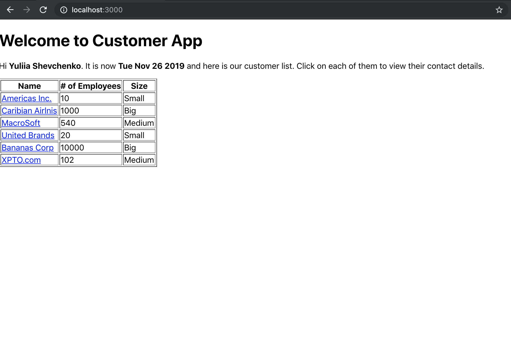

### TASK 1

### TASK 2
### Test Case : Welcome Page

|	Description|	Expected Results |
|---|---|
|Navigate to Welcome Home page|	Welcome page is opened.|
|Check that the following web parts are shown on the page: "Instructions", "Input Field", "Submit" button.|	All listed web parts are shown on the page.|
|Check that 'Instructoins' web part has following text.	| 'Instructions' web part shows "Please provide your name." |
|Check that 'Input Field' web part has following text "Users first name and last name". And empty text box to fill information.	|User is able to fill up his First and Last name in "Input field".|
|Check that 'Submit'  button is present on the page.	After User clicks to the "Submit" button customer list page is populated.|  If the input field is emty allert message PopUp "Please provide your name"|

### Test Case : Customer List Screen

|Description|	Expected Results|
|----|---|
|After User clicks "Submit" button application will launch Customer List Screen.|	Customer List Screen is opened.|
|Check that the following web parts are shown on the page: "Name", "Number of Employees", "Size".	|All listed web parts are shown on the page.|
|	Check that 'Name' web part has following text Name of registered customer.|	Name' web part shows "Name of registered customer."|
|Check that "Number of employees list" web part is present.	|User is able to see "Number of employees list".|
|	Check that "Size" web element.| If number **# of Employees** is less than or equal 100, size is **Small**; if greater then 10 and less then or equal 1000, **Medium**; otherwise, **Big**. Based on number of employees User gets proper size list.|

### Test Case : Contacts Detail List Screen

|Description	|Expected Results|
|---|---|
|After User fills customer list application will launch Contacts Detail List Screen.|	Contacts Detail List Screen is opened.|
|	Check that the following web parts are shown on the page: "Name", "Number of Employees", "Size", "Employees email", "Employees Name", "Back to the list" button.|	All listed web parts are shown on the page.|
|Verify if the Customer has corespondent contact info.|	Customer has corespondent name and e-mail of the person in the company to be contacted.|
|Verify if the Customer does not have contact info the message "No conctact info avalible".	| "No conctact info avalible" allert message is present on the page.|
|	Check if "Back to the list" button is returning User back to the "Customer List Screen" if clicked.	|User returned to the "Customer List Screen".|

### TASK 3
`mvn test -Dtest=ApiTests`

### TASK 4
`mvn test -Dtest=UiTests`